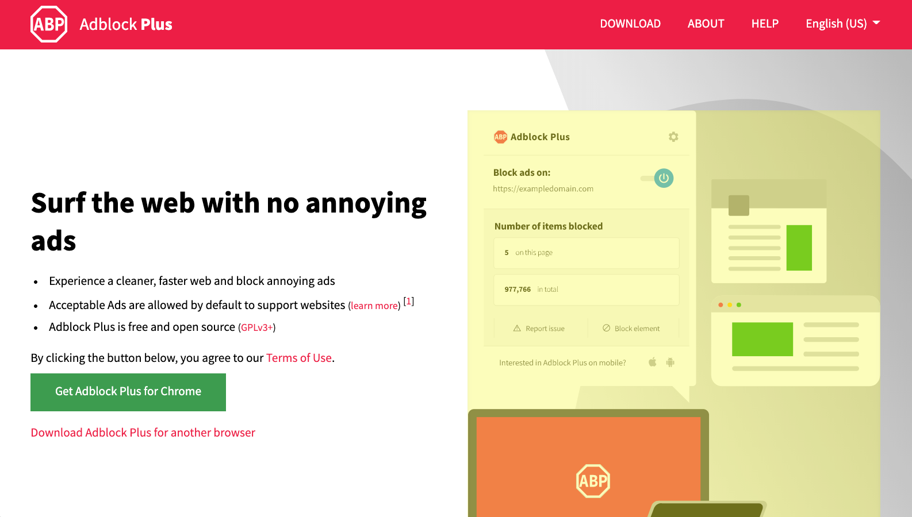

ABPKit
======
WebKit content blocker management framework for iOS and macOS supporting both Safari and WKWebView.

## History
This project serves the future of content blocking on iOS and macOS after evolving out of the ABP for Safari iOS app. Built upon a newly created functional and reactive Swift architecture, it employs RxSwift/Combine for mastery over asynchronous operations. State handling is through an immutable model conforming to Codable with persistence to local storage. Remaining legacy dependencies are intended to be resolved with further updates.

- ABPKit (based on RxSwift) is available.
- ABPKit-Combine is under active development and not yet suitable for production use.

## Features
- Non-blocking operations are directed by an immutable user state, preventing the need for locks or additional event observers to maintain consistency
- Example [host apps](#host-apps) for iOS and macOS are provided as a separate project in a workspace
- Automatic downloading of remote block list sources when needed
- Option for [bundled block lists](#bundled-block-lists-config) to be used before downloads
- New block list sources are activated as soon as they are ready
- Rule lists and downloads are synchronized (or pruned) according to user state
- Automatic WebKit rule compilation and removal, to prevent accumulation
- Persistable user state to local storage
- Whitelistable domain names for users
- Automatic [periodic block list updates](#periodic-block-list-updates) that can be temporarily suspended

## Installation
Tested with Xcode 11, RxSwift 5, iOS (11/12/13) and macOS 10.14 (Mojave).

### Building
- `git clone git@gitlab.com:eyeo/adblockplus/abpkit.git`
- `brew install carthage`
- `brew install swiftlint` (optional)
- `cd abpkit`
- `cp Cartfile.binary Cartfile` (optional)
- `carthage update --platform "ios,macos"`
- `open ABPKit.xcworkspace`
- Choose a scheme and build it in Xcode

The ABPKit framework depends only on RxSwift (beyond the iOS or macOS SDKs). RxRelay and RxBlocking only apply to the testing targets. Switching between ABPKit-Combine and RxSwift-based ABPKit targets may require a clean build to properly resolve symbols.

### Testing
Included unit tests verify correct results for many usages.

Additionally, mutable state handling can be verified through UI testing where automatic updates, the active tab, and the selected block list can be rapidly changed, continuously. This testing is not intended for general use but see [HostAppTester.swift](ABPKitDemo/HostApp-common/HostAppTester.swift) for details.

## Manage ABPKit with Carthage in your project

The legacy build system is required to build with Carthage. Otherwise, the new build system may be used.

### Preparing ABPKit in your project
Add this line to your `Cartfile`:
```
git "https://gitlab.com/eyeo/adblockplus/abpkit" ~> 0.4
```
### Building ABPKit in your project
Run:

- `carthage update --platform "ios,macos"`

Built frameworks will be in `Carthage/Build/`. Drag them into Xcode, as needed.

### Configuration of your project
<a name="app-groups"></a>
#### 1. App groups
App groups are required on iOS and macOS to identify local data stores for the framework. Please
copy the property list named [`ABPKit-Configuration.plist`](ABPKit-Configuration.plist) to
your main bundle and set values for the keys `appGroupIOS` and `appGroupMacOS` to match one of
your active entitlements where a value, but not the key, may be empty if the platform will not
be used. This file should be copied into _your project's main bundle_ during a build copy phase.

<a name="bundled-block-lists-config"></a>
#### 2. Bundled block lists
By default, bundled block lists will not be copied to the built framework and, therefore, will not be available at runtime. To have them accessible to ABPKit for your app, set the value of `installBundledBlockLists` in `ABPKit-BundledBlockLists.plist` to `YES` and they will be copied at build time. See [bundled block lists usage](#bundled-block-lists-usage) for more information.

<a name="figure-1"></a>
<div style="width: 80%; margin-left: auto; margin-right: auto;">
<hr/>

<hr/>
Figure 1: Host app content blocking example. The highlighted element (shown) will be hidden when AA enabled is false.
</div>

#### 3. Partners
- The copy of the property list named `ABPKit-Configuration.plist` linked in [(1) App
groups](#app-groups), also provides configuration of essential key-value pairs used to
identify your integration while downloading filter lists. It is vital to update these
values with every release of your product in order to match the newest name/version.
- Please adjust `partnerApplication` to match the name of your product and adjust
`partnerApplicationVersion` to match the version of your product. For example, set key
`partnerApplication` to `CustomBrowser` and key `applicationVersion` to `1.5.11a`.
- Please only adjust `addonName` after consulting with eyeo.

<a name="host-apps"></a>
## Host app demonstrations
Example apps for iOS and macOS are included in the project `ABPKitDemo` to demonstrate some of the usages of ABPKit. The status of content blocking can be observed in the console and through the UI. Downloaded rules are not active until the message "Switched to Downloaded Rules" is displayed.

Since display of ads is not reliable in the host apps due to them not offering a full web browsing environment recognized by advertisers, debug builds have a blocking rule injected to verify content blocking via AA switching. Their default home page, adblockplus.org, is used as a test subject as illustrated in Figure 1. For the purpose of testing only, JavaScript is disabled for the domain.

- When AA is enabled, an exception rule is enabled and content is not blocked.
- When AA is disabled, the image (see [Figure 1](#figure-1)) matching the selector in the [debugging rule](ABPKit/ContentBlocking/WKWebView/WebKitContentBlocker+Debugging.swift) is hidden.

## Framework code examples
Integration of ABPKit is not intended to be possible by copy-and-pasting a series of code snippets. Rather, the following code samples illustrate some of the different contexts where calls to the framework may apply. The foundation of all operations is the User state model and having a clear understanding of its precise usage is the key to getting correct results.

### User state initialization
The data model that mediates all operations is based on immutable data structures that are persisted to local storage. An initial state is required to be stored to initialize the persistence layer. For a default user state, this can be done with the following code:

```swift
try User().save()
```

This stored User allows for sharing user state across [multiple web views](#multiple-web-views). Therefore, the initial state _should be performed outside_ of any web view instance. There is an example in the demo host app under [SetupShared.swift](ABPKitDemo/HostApp-common/SetupShared.swift).

### Content blocking in a WKWebView
```swift
import ABPKit

class WebViewVC: ABPBlockable
{
    var abp: ABPWebViewBlocker!
    var webView: WKWebView!

    override func viewDidLoad()
    {
        do { abp = try ABPWebViewBlocker(host: self) }
        catch let err { } // Handle any error inside the catch block
    }
}
```

### Whitelisting
```swift
// Set
abp.user = abp.user.whitelistedDomainsSet()(["example.com"]).saved()

// Get
let domains = abp.user.getWhiteListedDomains()
```

### Use content blocking sources automatically
```swift
// With the last saved user state:
abp.useContentBlocking(completeWith:
{
    // Code to load URL
})
```

Downloading of a block list is initiated, if needed.

<a name="persistence"></a>
### User state persistence
Many operations are controlled by the last saved user state. The following code shows how a User may be stored and retrieved. The demonstration host apps provide a concrete overview of how user states can be used in an app.

```swift
// Persist user state while replacing any existing version
try abp.user.save()

// Persist user state while replacing any existing version and return a copy
let saved = try abp.user.saved()

// Retrieve the last persisted state
let user = try User(fromPersistentStorage: true)
```
or
```swift
let user = try abp.lastUser()
```

### Enable/Disable Acceptable Ads (AA)
```swift
// Enable
abp.user = try abp.user.blockListSet()(BlockList(
    withAcceptableAds: true,
    source: RemoteBlockList.easylistPlusExceptions,
    initiator: .userAction))

// Disable
abp.user = try abp.user.blockListSet()(BlockList(
    withAcceptableAds: false,
    source: RemoteBlockList.easylist,
    initiator: .userAction))
```

The new block list can be activated with `useContentBlocking(completeWith:)`.

### Verify AA usage
```swift
let aaInUse = abp.user.acceptableAdsInUse()
```

<a name="bundled-block-lists-usage"></a>
### Bundled block lists
User state can be set to use bundled block lists before downloads. When this is the first state during `useContentBlocking(completeWith:)`, bundled lists will be used before attempting to download remote versions. See `firstUser(useBundledBlocklists:)` for an example.

```swift
abp.user = try abp.user.blockListSet()(BlockList(
    withAcceptableAds: true,
    source: BundledBlockList.easylistPlusExceptions,
    initiator: .userAction))
```

<a name="multiple-web-views"></a>
### Multiple web views
State changes to be shared among web views should be persisted and then loaded, as needed (see [User state persistence](#persistence)). The host apps, for iOS and macOS, provide an example of this state handling across two separate views embedded in tabs. The initial user state is created in each app's respective tab view controller. The last user state is then loaded when a tab is selected.

<a name="periodic-block-list-updates"></a>
### Periodic block list updates
Updates of the user's active block list are performed automatically for every 24-hour period when the host app is open. The expiration interval is based on the last download and only one update will happen per day, if needed. The update is based on the last downloaded block list. This behavior can be overridden for situations where a download may not be suitable such as low-bandwidth network conditions. Overriding the updates can be accomplished with a single function that returns the user to be updated.

#### Overriding the user state
If you want to override the user state used for updates, assign a function of type `() -> User?` to `ABPBlockListUpdater.sharedInstance().userForUpdates`. An example that will prevent updates from happening is shown below.

```swift
// Prevent user updates.
ABPBlockListUpdater.sharedInstance().userForUpdates = { () -> User? in return nil }
```

Restoring the original behavior can be accomplished with:

```swift
// Enable default user updates based on the last persisted user state.
ABPBlockListUpdater.sharedInstance().userForUpdates = ABPBlockListUpdater.defaultUserForUpdates
```

The function `userForUpdates` may be assigned at any time after an `ABPWebViewBlocker` has been created.

### Content Blocking on Safari for macOS
- Choose scheme `HostApp-macOS`
- Run in Xcode

The extension `HostCBExt-macOS` is installed to Safari. Content blocking in Safari can be activated by enabling the extension.

### Content Blocking on Safari for iOS
Not yet implemented.

## Release notes
Please see the [change log](CHANGELOG.md) for release notes.

## License
ABPKit is released as open source software under the GPL v3 license, see the [license file](LICENSE.md) in the project root for the full license text.
